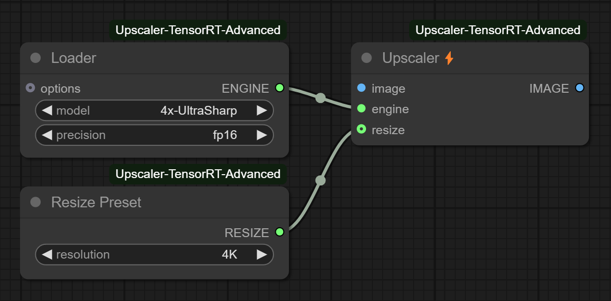
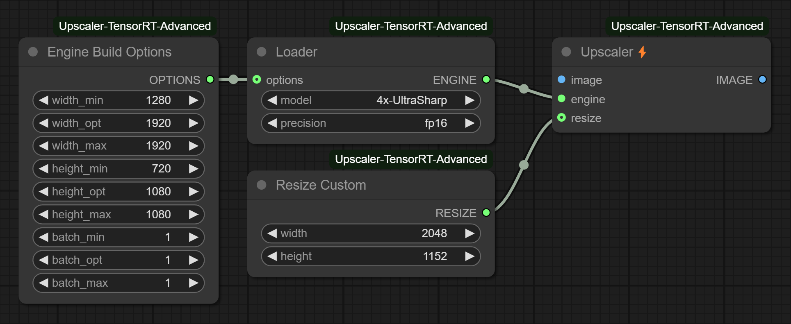

# ComfyUI Upscaler TensorRT Advanced ⚡

## Overview

This project is a fork of the original [ComfyUI-Upscaler-Tensorrt](https://github.com/yuvraj108c/ComfyUI-Upscaler-Tensorrt) by [yuvraj108c](https://github.com/yuvraj108c). The idea behind this fork is to provide users with control over previously constant or hidden parameters during the engine building process, such as adjusting the minimum, maximum input sizes, or modifying the post-upscale resize settings.

## Features

The fork can work on par with the original project, and the user is encouraged to first read the original project [README](https://github.com/yuvraj108c/ComfyUI-Upscaler-Tensorrt?tab=readme-ov-file).

- **Advanced Engine Build Options**: Users can fine-tune various parameters during the TensorRT engine building process, such as minimum, optimal, maximum width and height and batch size. *This allows to exceed the original 1280x1280 px resolution limit of the original project.*
- **Custom Resize Options**: Users can specify custom resize dimensions for the post upscale step.
- **Better Error Handling**: Improved error integration to ComfyUI and more checks to prevent worfklows from being stuck on non handled errors.

## Examples

### Simple

You can acheive the same result as the original project with the following setup:

### Advanced

But the fork also allows you to customize the resize dimensions and engine build options:

## Installation

### ComfyUI Manager

This project has not been submitted to the ComfyUI Manager registry yet. But you can still install it this way:

1. Open ComfyUI Manager.
2. Click the `Custom Nodes Manager` to open the custom nodes manager page.
3. On the bottom right corner, click the `Install via Git URL` button.
4. Enter the URL of this repository: `https://github.com/hekmon/ComfyUI-Upscaler-TensorRT-Advanced.git`.
5. Click "Confirm".
6. Restart ComfyUI.

### Manual

1. On the github page, click on the green `<> Code` button and then "Download ZIP".
2. Extract the root folder within the downloaded ZIP file to your ComfyUI `custom_nodes` directory.
3. Using the same python environment that runs ComfyUI, install the required dependencies: `python -m pip install -r custom_nodes/ComfyUI-Upscaler-TensorRT-Advanced/requirements.txt`.
4. Restart ComfyUI.
